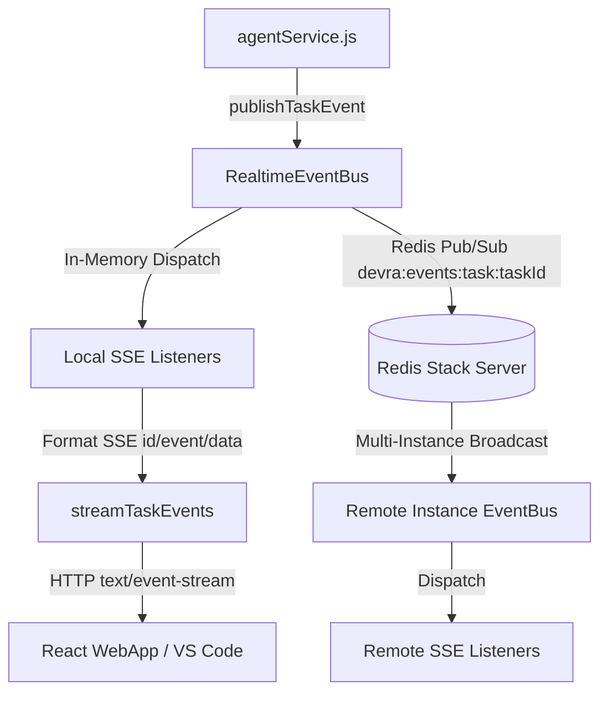

# DEVRA Real-time Streaming Implementation Report (SSE)

## 1. Previous Communication Architecture

Prior to this implementation, DEVRA's Agent Mode and AI code review workflows relied exclusively on synchronous HTTP request-response cycles with optional polling:
- **Client Latency & UX**: The client web app and VS Code extension remained in blocking loading states while backend AST analysis, multi-step plan generation, and diff verification executed.
- **Lack of Granular Visibility**: Intermediate phases (AST traversal, dependency mapping, safeguard verification, patch generation) were invisible to the user until the entire payload returned.
- **Scale Limitations**: Long-running agent tasks were susceptible to gateway / reverse-proxy HTTP request timeouts (e.g. 30s/60s Cloudflare or NGINX timeouts).

---

## 2. Chosen Transport & Justification

### Selected Transport: Server-Sent Events (SSE)

We evaluated **Server-Sent Events (SSE)** versus **WebSockets** against DEVRA's operational requirements:

| Dimension | Server-Sent Events (SSE) | WebSockets | Verdict / Justification |
| :--- | :--- | :--- | :--- |
| **Directionality** | Unidirectional (Server → Client) | Bidirectional | **SSE Winner**: Agent task progression is server-driven; client state changes (approve, apply, reject) remain idempotent REST POST operations. |
| **Protocol & Framing** | Standard HTTP/1.1 & HTTP/2 (`text/event-stream`) | Custom WS framing protocol (`ws://` / `wss://`) | **SSE Winner**: Standard HTTP passes through corporate firewalls, reverse proxies, and NGINX without custom upgrade configurations. |
| **Reconnection Support** | Built-in browser auto-reconnect with `Last-Event-ID` | Manual heartbeat & reconnection logic required | **SSE Winner**: Standard browser `EventSource` handles dropped connections transparently. |
| **Authentication** | Standard JWT Bearer header or Query Token (`?token=...`) | Query token or sub-protocol negotiation | **SSE Winner**: Integrates cleanly with existing [authMiddleware.js](file:///c:/Users/SIDDHARTH/Documents/Devra/server/src/middleware/authMiddleware.js). |
| **Overhead** | Minimal, lightweight text stream | Persistent bidirectional socket management | **SSE Winner**: Simpler server lifecycle and clean memory footprint. |

---

## 3. Standard Event Contract

The contract is codified in [eventContract.js](file:///c:/Users/SIDDHARTH/Documents/Devra/server/src/services/realtime/eventContract.js):

### Event Types
- `task.started`: Triggered when planning or diff generation initializes.
- `task.progress`: Live percentage, phase, step numbers, and descriptive status messages.
- `task.step`: Discrete milestone completion (e.g., AST analysis finished).
- `review.started` / `review.finding` / `review.completed`: Code review streaming milestones.
- `task.completed`: Final payload delivery (`plan_ready`, `changes_ready`, or `applied`).
- `task.failed`: Error details with sanitized messages.
- `task.cancelled`: User rejection rationale (`rejected`).
- `heartbeat`: 15-second keep-alive packet.

### Structured Event Schema
```json
{
  "id": "evt_1712345678_a1b2c3d4",
  "type": "task.progress",
  "taskId": "65d1f8e9a2b3c4d5e6f7a8b9",
  "timestamp": "2026-10-10T04:15:00.000Z",
  "progress": {
    "step": 2,
    "totalSteps": 3,
    "percent": 65,
    "phase": "planning",
    "message": "Analyzing repository architecture and affected files..."
  },
  "payload": {
    "affectedFiles": ["server/src/models/User.js", "server/src/routes/authRoutes.js"]
  }
}
```

### Sanitization Guard
The `sanitizePayload` utility recursively redacts any passwords, JWT secrets, authentication headers, or raw environment tokens before events are emitted over the wire.

---

## 4. Endpoints

- **`GET /api/agent/tasks/:taskId/events`** (Primary SSE Streaming Endpoint)
- **`GET /api/agent/:id/stream`** (Convenience Route Alias)
- **`GET /api/agent/:id`** (Existing REST polling / direct query compatibility preserved)

### SSE Headers Configured
```http
HTTP/1.1 200 OK
Content-Type: text/event-stream
Cache-Control: no-cache, no-transform
Connection: keep-alive
X-Accel-Buffering: no
```

---

## 5. Authentication and Authorization

1. **Multi-Source JWT Extraction**: [authMiddleware.js](file:///c:/Users/SIDDHARTH/Documents/Devra/server/src/middleware/authMiddleware.js) verifies JWT tokens from both `Authorization: Bearer <token>` headers and `?token=<jwt>` query parameters (required for browser `EventSource` connections).
2. **Strict Ownership Check**: [agentController.js](file:///c:/Users/SIDDHARTH/Documents/Devra/server/src/controllers/agentController.js) queries `AgentSession.findOne({ _id: taskId, userId: req.user._id })`. Access is strictly forbidden if the session belongs to a different tenant.

---

## 6. Backend Publishing Flow & Multi-Instance Architecture



- **In-Memory Core**: Local Node.js `EventEmitter` handles high-throughput zero-latency dispatching.
- **Distributed Redis Pub/Sub**: When Redis is available, events broadcast across channel `devra:events:task:{taskId}`, allowing any backend cluster instance to stream events to clients regardless of where the task was initiated.
- **Vector Store Isolation**: The Realtime EventBus operates completely independently from the Redis Vector Store (different connections, key prefixes, and channel namespaces).

---

## 7. Frontend Integration

1. **API Client Integration**: [api.js](file:///c:/Users/SIDDHARTH/Documents/Devra/client/src/services/api.js) provides `agentApi.createEventStream(sessionId, { onEvent, onError, onOpen })`.
2. **Live Progress HUD**: [AgentModePanel.jsx](file:///c:/Users/SIDDHARTH/Documents/Devra/client/src/components/agent/AgentModePanel.jsx) renders an animated progress bar, real-time status ticker, and connection mode indicator (`Live SSE Active` vs `Polling Fallback`).
3. **Lifecycle Management**: Event streams automatically connect upon session activation and cleanly close when tasks finalize or components unmount (`useRef` cleanup).

---

## 8. VS Code Extension Compatibility

- **Node.js HTTP/HTTPS Streaming**: [apiService.ts](file:///c:/Users/SIDDHARTH/Documents/Devra/extension/src/services/apiService.ts) implements `streamAgentEvents` using native Node.js `http`/`https` chunk streaming.
- **Zero Browser Polyfill Dependency**: Compatible with standard VS Code Extension runtime without requiring DOM `EventSource`.
- **Existing Commands Preserved**: `devpilot.agentMode`, `devpilot.reviewCode`, `devpilot.explainCode`, and `devpilot.generateTests` remain 100% operational.

---

## 9. Reconnection & Error Resilience

- **Heartbeat Packets**: Sent every 15 seconds to prevent intermediate proxy connection dropouts.
- **Terminal State Handling**: Streams for finalized tasks (`applied`, `rejected`, `failed`) send the terminal event and close gracefully with `res.end()`.
- **Client Disconnect Cleanup**: `req.on("close")` and `req.on("error")` immediately clear heartbeat intervals and unsubscribe listeners to prevent memory leaks.
- **Graceful Polling Fallback**: If SSE encounters network errors, the client transitions seamlessly to polling (`agentApi.getSession`).

---

## 10. Tests Executed

30 automated tests executed with 100% pass rate in [test.js](file:///c:/Users/SIDDHARTH/Documents/Devra/server/test.js):

1. `Bcrypt password hashing and verification` (`PASS`)
2. `JWT token signing and verification` (`PASS`)
3. `AST ignore filters` (`PASS`)
4. `Language detection` (`PASS`)
5. `Entry point detection` (`PASS`)
6. `Unified diff generator` (`PASS`)
7. `Agent safeguards security validator` (`PASS`)
8. `MemoryVectorStore initialization and health check` (`PASS`)
9. `Vector upsert & deterministic replacement` (`PASS`)
10. `Vector search & top-K ranking` (`PASS`)
11. `Repository isolation (Repo A never returns Repo B)` (`PASS`)
12. `Delete namespace & re-indexing` (`PASS`)
13. `Branch filtering isolation` (`PASS`)
14. `Empty queries and malformed inputs` (`PASS`)
15. `VectorStoreFactory fallback` (`PASS`)
16. `Document chunking with line overlaps` (`PASS`)
17. `RedisVectorStore Float32 buffer conversion` (`PASS`)
18. `RedisVectorStore tag escaping` (`PASS`)
19. `RedisVectorStore pipeline execution` (`PASS`)
20. `formatSSEMessage serialization format` (`PASS`)
21. `sanitizePayload credential redaction` (`PASS`)
22. `EventBus publishing & delivery to subscribers` (`PASS`)
23. `Unsubscribe teardown & leak prevention` (`PASS`)
24. `Cross-task event scoping (task A vs task B)` (`PASS`)
25. `Task progress percentage clamping (0-100)` (`PASS`)
26. `Task completion event with 100% progress` (`PASS`)
27. `Task cancellation event with rejection reason` (`PASS`)
28. `Heartbeat keep-alive event format` (`PASS`)
29. `EventBus health telemetry reporting` (`PASS`)
30. `Vector Store non-regression verification` (`PASS`)

---

## Final Verdict

**READY FOR NEXT IMPROVEMENT**
