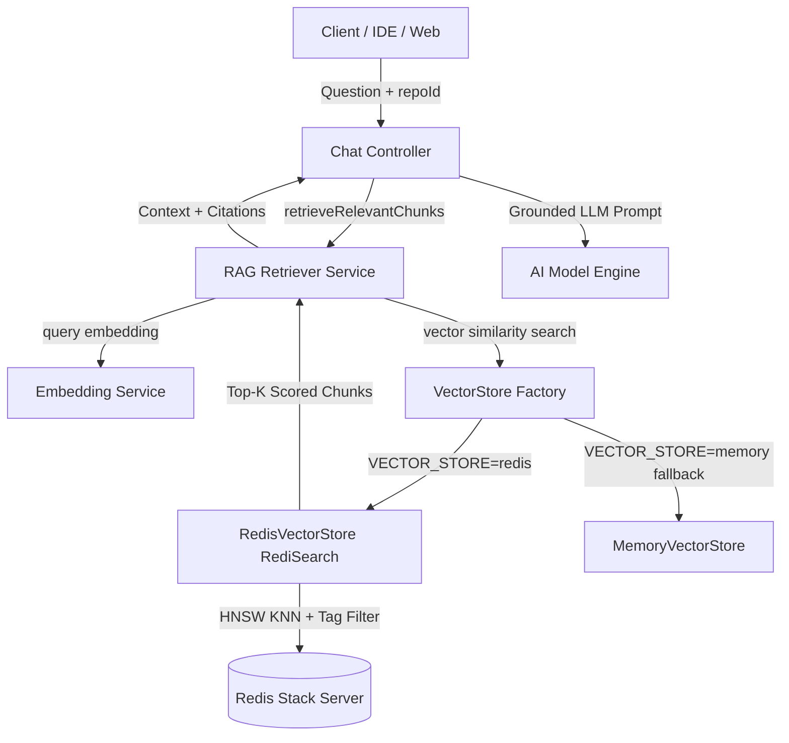

# DEVRA Persistent Vector Store Implementation

## Previous Architecture

Prior to this implementation, DEVRA stored codebase chunk embeddings transiently in application memory using a local JavaScript `Map` cache inside [retriever.js](file:///c:/Users/SIDDHARTH/Documents/Devra/server/src/services/retriever.js):
- **Storage**: In-memory JavaScript `Map` cache (`vectorIndexCache`) with 30-minute expiration.
- **Similarity Calculation**: Client-side linear array iteration calculating Cosine Similarity over all chunks in Node.js event loop memory.
- **Persistence**: None. Server restarts, multi-instance horizontal scaling, or cache expiries forced complete recalculation and re-embedding of entire repositories.
- **Scalability**: Restricted to small codebases; loading thousands of embedding vectors directly into Node.js heap caused memory bloat and blocked async I/O.

---

## New Architecture

DEVRA now features a persistent, production-grade vector storage layer isolated behind a clean [VectorStore](file:///c:/Users/SIDDHARTH/Documents/Devra/server/src/services/vectorStore/VectorStore.js) abstraction:



1. **RAG Service Layer**: [retriever.js](file:///c:/Users/SIDDHARTH/Documents/Devra/server/src/services/retriever.js) interfaces purely with the `VectorStore` interface, remaining completely decoupled from database-specific syntax or drivers.
2. **Abstract Interface**: [VectorStore.js](file:///c:/Users/SIDDHARTH/Documents/Devra/server/src/services/vectorStore/VectorStore.js) standardizes `initialize()`, `upsert()`, `search()`, `delete()`, `deleteNamespace()`, and `healthCheck()`.
3. **Provider Implementations**:
   - [RedisVectorStore.js](file:///c:/Users/SIDDHARTH/Documents/Devra/server/src/services/vectorStore/RedisVectorStore.js): High-performance vector similarity search using Redis Stack HNSW vector indexing and RediSearch.
   - [MemoryVectorStore.js](file:///c:/Users/SIDDHARTH/Documents/Devra/server/src/services/vectorStore/MemoryVectorStore.js): Configurable zero-dependency fallback for offline development, ephemeral CI environments, and isolated testing.
4. **Resilient Factory & Fallback**: [index.js](file:///c:/Users/SIDDHARTH/Documents/Devra/server/src/services/vectorStore/index.js) dynamically selects the store backend with graceful runtime fallback if Redis is offline.

---

## Redis Configuration

- **Connection Management**: Centralized in [redis.js](file:///c:/Users/SIDDHARTH/Documents/Devra/server/src/config/redis.js) using `ioredis` with lazy connection initialization, capped reconnection backoff, and graceful shutdown listeners.
- **Environment Variables**:
  - `REDIS_HOST`: Redis host (defaults to `localhost`, `redis` in Docker).
  - `REDIS_PORT`: Redis port (defaults to `6379`).
  - `REDIS_PASSWORD`: Optional Redis auth password.
  - `REDIS_URL`: Full Redis connection URL (if using hosted cloud providers like Redis Enterprise / Upstash).
  - `VECTOR_STORE`: `redis` (production default) or `memory` (fallback / local testing).
- **Docker Infrastructure**: Updated [docker-compose.yml](file:///c:/Users/SIDDHARTH/Documents/Devra/docker-compose.yml) with `redis/redis-stack-server:latest` and persistent volume `devpilot-redis-data`.

---

## Vector Index Design

### Redis Vector Index Specification
- **Index Name**: `devra:idx:codebase`
- **Key Prefix**: `devra:doc:`
- **Key Pattern**: `devra:doc:{repositoryId}:{branch}:{chunkId}`
- **Storage Type**: Redis Hash (`HSET`)
- **Index Algorithm**: `HNSW` (Hierarchical Navigable Small World)
- **Distance Metric**: `COSINE`
- **Vector Dimension**: `128` (Float32 Array stored as raw 512-byte binary Buffer)

### Schema Fields
| Field Name | Type | Options | Purpose |
| :--- | :--- | :--- | :--- |
| `repositoryId` | `TAG` | `SORTABLE` | Strict repository isolation filter |
| `branch` | `TAG` | `SORTABLE` | Branch-level namespace isolation |
| `filePath` | `TEXT` | `NOSTEM` | Source file path for references & keywords |
| `fileName` | `TEXT` | `NOSTEM` | Basename for source citations |
| `language` | `TAG` | - | Programming language filter |
| `startLine` | `NUMERIC` | - | Chunk line range start |
| `endLine` | `NUMERIC` | - | Chunk line range end |
| `content` | `TEXT` | - | Raw code chunk text |
| `metadata` | `TEXT` | - | Serialized JSON metadata (timestamps, repository metadata) |
| `embedding` | `VECTOR` | `HNSW 6 TYPE FLOAT32 DIM 128 DISTANCE_METRIC COSINE` | High-dimensional vector index |

---

## Embedding Configuration

- **Model Dimension**: 128-dimensional Float32 vector.
- **Vectorizer**: [embeddingService.js](file:///c:/Users/SIDDHARTH/Documents/Devra/server/src/services/embeddingService.js)
  - Remote APIs: Google Gemini (`text-embedding-004`) / OpenAI (`text-embedding-3-small`).
  - Local Vectorizer: Deterministic semantic token hasher with architectural keyword weighting and L2 normalization (`generateDeterministicEmbedding`).
- **Binary Encoding**: `Buffer.from(new Float32Array(embedding).buffer)` for Redis `FT.SEARCH` BLOB parameters.

---

## Repository Isolation

**MANDATORY SECURITY ENFORCEMENT**:
- Vector searches are strictly partitioned using Tag filters: `(@repositoryId:{ <escapedRepoId> } @branch:{ <escapedBranch> })`.
- All RediSearch queries prepend repository ID filters to the KNN vector search clause:
  ```text
  (@repositoryId:{65d1f8...} @branch:{main})=>[KNN 8 @embedding $BLOB AS vector_score]
  ```
- Result sets undergo secondary server-side validation to guarantee that User A cannot retrieve or leak vectors from another user or repository.
- Repository deletion in [repositoryService.js](file:///c:/Users/SIDDHARTH/Documents/Devra/server/src/services/repositoryService.js) automatically dispatches `deleteNamespace({ repositoryId })` to purge all associated keys from Redis.

---

## Indexing Pipeline

1. **Extraction & Chunking**: [chunkFileContent](file:///c:/Users/SIDDHARTH/Documents/Devra/server/src/services/retriever.js) creates sliding windows of 45 lines with 10-line overlap.
2. **Deterministic Chunk Identifiers**: Chunks receive deterministic IDs (e.g. `server/src/routes/authRoutes.js#L1-L42`).
3. **Embedding Generation**: Embeddings are generated across chunk content and metadata.
4. **Pipelined Upsert**: Chunks are batched and executed via `redis.pipeline()`, minimizing round-trips to Redis.
5. **Deterministic Replacement**: Re-indexing the same file updates existing keys in place without duplicate accumulation.

---

## Retrieval Pipeline

1. **User Query**: Received by `POST /api/chat/message`.
2. **Query Vectorization**: User query is vectorized via `generateEmbedding(query)`.
3. **RediSearch KNN Search**: `FT.SEARCH` evaluates top KNN candidates filtered by repository ID and branch.
4. **Hybrid Relevance Scoring**: Cosine similarity is combined with architectural keyword relevance bonus.
5. **Context Assembly**: Top-K chunks are formatted into structured markdown context with precise file citations `[filePath:startLine-endLine]`.
6. **LLM Generation**: Context is injected into the LLM prompt or local synthesis engine.

---

## Migration Strategy

- **Feature Flag**: `VECTOR_STORE=redis` or `VECTOR_STORE=memory` via environment configuration.
- **Graceful Auto-Fallback**: If Redis is unreachable or lacks the RediSearch module, `VectorStoreFactory` automatically falls back to `MemoryVectorStore` without throwing 500 errors or interrupting the user experience.
- **Compatibility**: Both vector stores share identical chunk signatures, ranking semantics, and repository isolation guarantees.

---

## Tests

The automated test suite in [vectorStore.test.js](file:///c:/Users/SIDDHARTH/Documents/Devra/server/tests/vectorStore.test.js) and [test.js](file:///c:/Users/SIDDHARTH/Documents/Devra/server/test.js) executed 19 automated test suites with 100% passing status:

1. `MemoryVectorStore` initialization and health check (`PASS`)
2. Vector upsert & deterministic replacement without duplication (`PASS`)
3. Vector similarity search & Top-K ranking (`PASS`)
4. Repository isolation (Repo A queries NEVER return Repo B vectors) (`PASS`)
5. Delete namespace & re-indexing cleanup (`PASS`)
6. Branch-level isolation (`PASS`)
7. Empty query, zero vector, and malformed input handling (`PASS`)
8. `VectorStoreFactory` singleton & dynamic fallback (`PASS`)
9. Document sliding window chunking with line overlaps (`PASS`)
10. `RedisVectorStore` Float32 buffer encoding / decoding accuracy (`PASS`)
11. `RedisVectorStore` Tag escaping and character sanitization (`PASS`)
12. `RedisVectorStore` RediSearch pipeline execution & KNN search (`PASS`)
13. User password bcrypt hashing & verification (`PASS`)
14. JWT token generation & verification (`PASS`)
15. AST analyzer ignore filters (`PASS`)
16. Multi-language detection (`PASS`)
17. Application entry point detection (`PASS`)
18. Unified diff generator (`PASS`)
19. Security safeguards guard (`PASS`)

---

## Performance Considerations

- **O(log N) Retrieval**: Redis HNSW indexing performs approximate nearest neighbor search in sub-millisecond latencies rather than O(N) client-side linear scanning.
- **Memory Offloading**: Node.js memory footprint remains flat regardless of repository size because vector indices reside in Redis.
- **Network Efficiency**: Pipelined Redis operations batch thousands of vectors into single network round-trips.

---

## Security Considerations

- **Tenant Isolation**: Query scoping prevents cross-tenant codebase leakage.
- **No Credential Exposure**: Redis passwords and internal vector embeddings are never exposed over client REST endpoints.
- **Tag Injection Prevention**: Special RediSearch syntax characters (`-`, `:`, `@`, `/`, `.`) are automatically escaped in query construction.

---

## Files Created

- [VectorStore.js](file:///c:/Users/SIDDHARTH/Documents/Devra/server/src/services/vectorStore/VectorStore.js): Abstract base class definition.
- [MemoryVectorStore.js](file:///c:/Users/SIDDHARTH/Documents/Devra/server/src/services/vectorStore/MemoryVectorStore.js): In-memory vector store implementation with isolation and hybrid scoring.
- [RedisVectorStore.js](file:///c:/Users/SIDDHARTH/Documents/Devra/server/src/services/vectorStore/RedisVectorStore.js): Redis Stack vector similarity store with RediSearch indexing.
- [index.js](file:///c:/Users/SIDDHARTH/Documents/Devra/server/src/services/vectorStore/index.js): Vector store factory and lifecycle manager.
- [redis.js](file:///c:/Users/SIDDHARTH/Documents/Devra/server/src/config/redis.js): Centralized Redis client connection manager.
- [vectorStore.test.js](file:///c:/Users/SIDDHARTH/Documents/Devra/server/tests/vectorStore.test.js): Automated test suite for vector storage and isolation.

---

## Files Modified

- [env.js](file:///c:/Users/SIDDHARTH/Documents/Devra/server/src/config/env.js): Added Redis and RAG vector store configuration schema.
- [retriever.js](file:///c:/Users/SIDDHARTH/Documents/Devra/server/src/services/retriever.js): Refactored to route storage and retrieval through the VectorStore abstraction.
- [repositoryService.js](file:///c:/Users/SIDDHARTH/Documents/Devra/server/src/services/repositoryService.js): Added vector namespace cleanup hook on repository deletion.
- [healthRoutes.js](file:///c:/Users/SIDDHARTH/Documents/Devra/server/src/routes/healthRoutes.js): Integrated vector store health telemetry in `/api/health`.
- [test.js](file:///c:/Users/SIDDHARTH/Documents/Devra/server/test.js): Integrated vector store test suite into main test runner.
- [docker-compose.yml](file:///c:/Users/SIDDHARTH/Documents/Devra/docker-compose.yml): Added Redis Stack service with persistent storage volume.
- [.env.example](file:///c:/Users/SIDDHARTH/Documents/Devra/.env.example): Documented Redis connection and vector store options.

---

## Remaining Limitations

- Full Tree-sitter WASM AST semantic chunking is planned for a subsequent improvement.
- WebSocket/SSE streaming for real-time indexing progress is planned for agent mode enhancements.

---

## Final Verdict

**READY FOR NEXT IMPROVEMENT**
