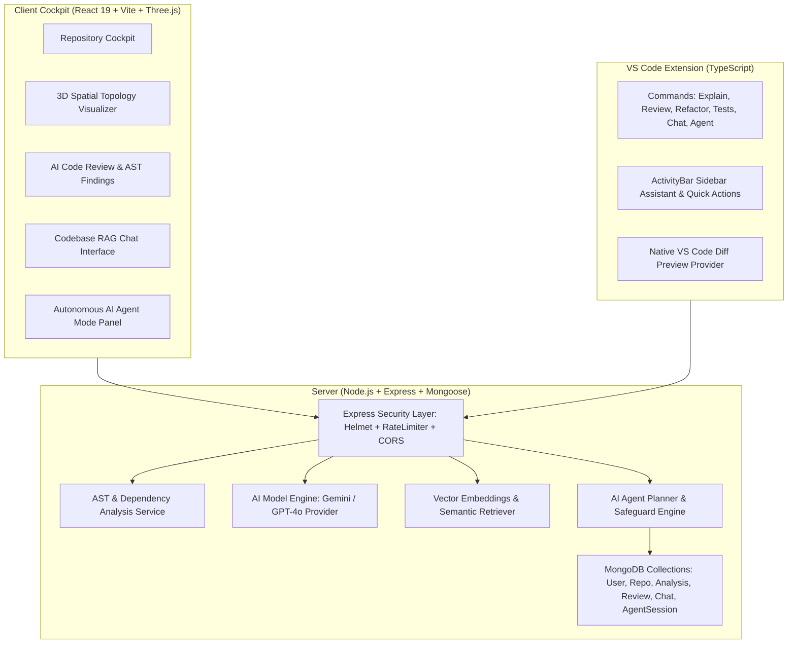

# DevPilot / Devra Platform Architecture

## Executive Overview
**DevPilot** is a next-generation AI developer observability platform uniting full-stack codebase intelligence, 3D interactive spatial dependency graphs, automated AST code reviews, vector RAG codebase chat, autonomous AI Agent workflows, and editor-native VS Code extensions into a cohesive, secure ecosystem.



---

## Directory Structure

```
Devra/
├── .env.example          # Monorepo environment variable template
├── .gitignore            # Root git ignore rules
├── docker-compose.yml    # Full-stack Docker orchestration
├── ecosystem.config.cjs  # PM2 cluster configuration
├── package.json          # Monorepo workspaces and root scripts
├── README.md             # Developer setup and architectural guide
├── client/               # React 19 + Vite frontend application
│   ├── src/
│   │   ├── components/   # React UI components (3D visualizer, Agent panel, layout)
│   │   ├── pages/        # Dashboard, Repositories, Review, Chat, Settings
│   │   ├── services/     # Axios API service integrations
│   │   ├── App.jsx       # Lazy-loaded router with suspense
│   │   └── main.jsx      # Client entrypoint
│   ├── Dockerfile        # Multi-stage production Nginx container
│   ├── nginx.conf        # Nginx SPA router & asset cache config
│   └── vite.config.js    # Vite bundler & manual vendor chunks
├── server/               # Express REST API backend
│   ├── src/
│   │   ├── config/       # Environment & database configurations
│   │   ├── controllers/  # Request controllers (auth, repo, analysis, review, chat, agent)
│   │   ├── middleware/   # Security (helmet, cors, rateLimiter, errorMiddleware)
│   │   ├── models/       # Mongoose schemas (User, Repository, Analysis, Review, Chat, AgentSession)
│   │   ├── routes/       # API routers mounted under /api/*
│   │   ├── services/     # Core business logic (aiService, agentService, analysisService)
│   │   ├── utils/        # Structured logger, JWT helpers, diff generators
│   │   ├── app.js        # Express middleware and route mounting
│   │   └── server.js     # Server bootstrap and graceful shutdown lifecycle
│   └── Dockerfile        # Production Node.js 20 Alpine container
├── extension/            # VS Code extension (TypeScript)
│   ├── src/
│   │   ├── commands/     # Commands (agentMode, explainCode, reviewCode, refactorCode, generateTests)
│   │   ├── providers/    # Sidebar webview provider
│   │   ├── services/     # ApiService, previewProvider (virtual diff documents)
│   │   └── extension.ts  # Extension lifecycle activation
│   ├── package.json      # VS Code manifest and command contributions
│   └── tsconfig.json     # Extension TypeScript configuration
├── shared/               # Cross-package shared types and constants
└── docs/                 # Architecture, API, and Deployment documentation
    ├── architecture.md
    ├── api.md
    └── deployment.md
```

---

## Architectural Principles & Safeguards

1. **Autonomous AI Agent Mode with Human-in-the-Loop Control**:
   - Zero silent modifications: The agent plans first, waits for user approval, generates diffs, and requests confirmation before touching workspace files.
   - Non-destructive execution: Deletions require explicit confirmation; hardcoded secrets and dangerous shell commands are blocked by AST safety scanners.
   - 100% reversible: Pre-modification snapshots of original files are stored in MongoDB.

2. **Codebase Intelligence & Vector Retrieval (RAG)**:
   - Code chunking with language-aware boundaries.
   - Semantic retrieval with cosine similarity over embeddings so only relevant code snippets are transmitted to the LLM (the entire repository is never sent blindly).
   - Strict source citations referencing file names and line ranges.

3. **High-Performance 3D Visualization**:
   - Built on Three.js, React Three Fiber, and @react-three/drei.
   - Single-draw-call batched line segments for topological dependency edges.
   - Optimized sphere geometries (16-20 segments) with instanced group coloring (Frontend, Backend, Database, Services, Utilities).
   - Dynamic code-splitting: Three.js bundle is isolated in an on-demand vendor chunk.

4. **Production Security Foundation**:
   - JWT authentication with hashed passwords (`bcryptjs` with salt rounds 10).
   - `express-rate-limit` on general API (300 req/15min), auth endpoints (20 req/15min), and AI endpoints (60 req/15min).
   - Helmet security headers with cross-origin resource policy.
   - Structured logging respecting `NODE_ENV` with error sanitization.
